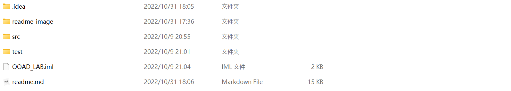
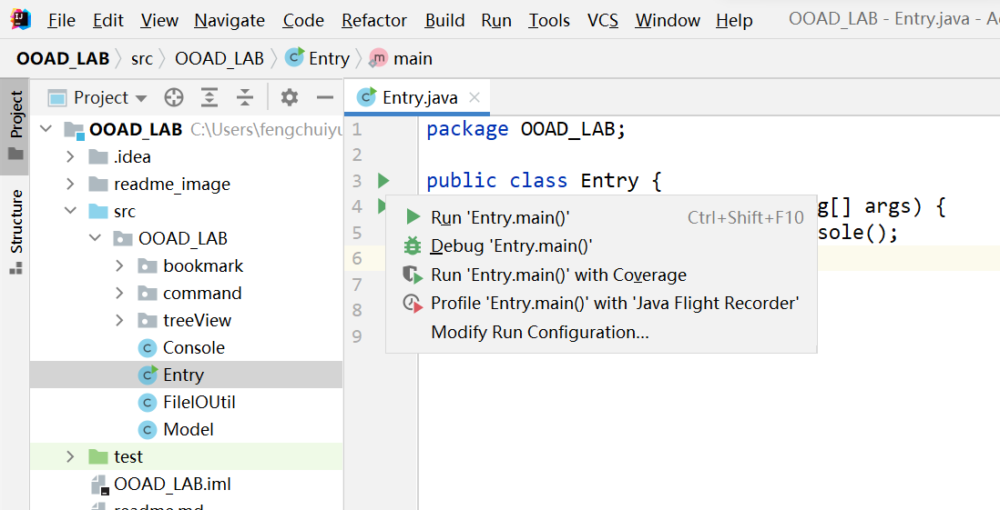
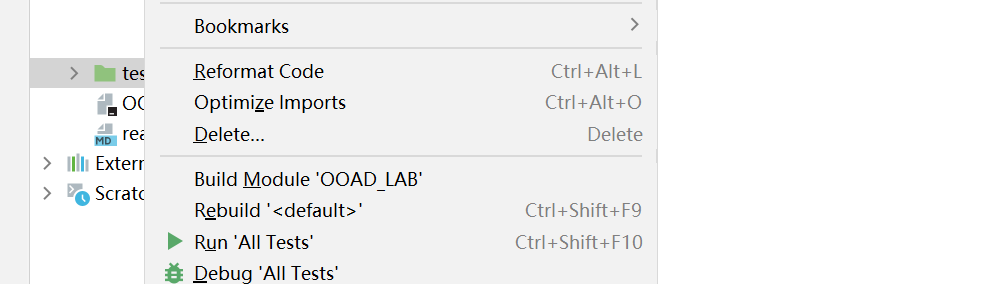
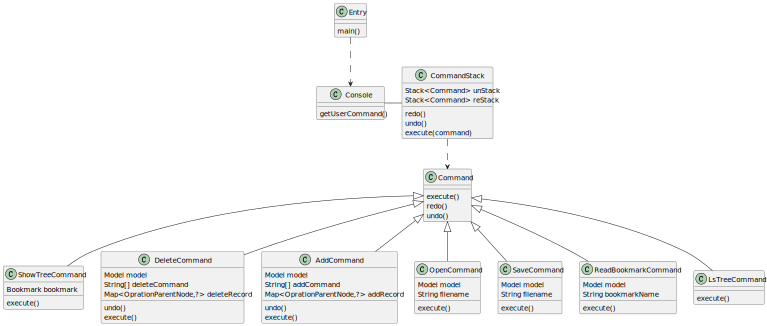
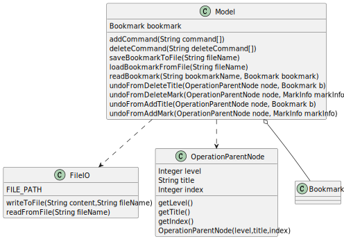
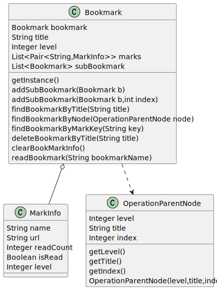
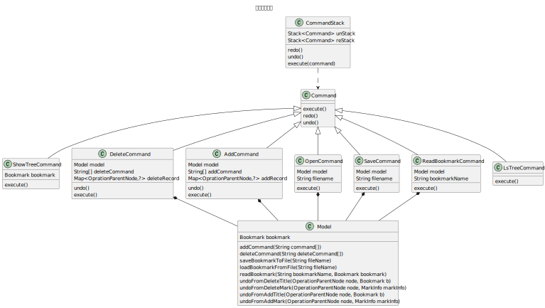
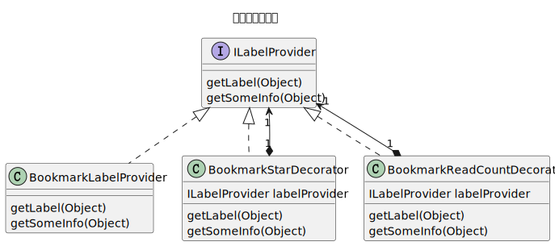
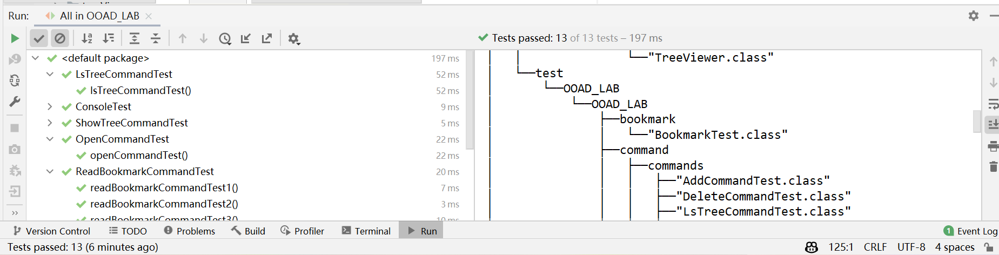

# Lab 设计模式  郭仲天 19307110250

### 如何运行&测试

#### 方法一:


#### 方法二:

1.将压缩包解压缩,里面包括了源代码

</img>

2.使用idea打开,进入src/Entry.java中,运行main函数,即可运行代码

</img>

3.在test目录右键,点击run all test,即可运行所有测试用例

</img>

### 目录结构

```bash
├──src # 源文件代码目录
│   └──OOAD_LAB
│       ├──bookmark
│       │   ├──"Bookmark.java"
│       │   ├──"MarkInfo.java"
│       │   └──"OperationParentNode.java"
│       ├──command
│       │   ├──"Command.java"
│       │   ├──commands
│       │   │   ├──"AddCommand.java"
│       │   │   ├──"DeleteCommand.java"
│       │   │   ├──"LsTreeCommand.java"
│       │   │   ├──"OpenCommand.java"
│       │   │   ├──"ReadBookmarkCommand.java"
│       │   │   ├──"SaveCommand.java"
│       │   │   └──"ShowTreeCommand.java"
│       │   └──"CommandStack.java"
│       ├──"Console.java"
│       ├──"Entry.java"
│       ├──"FileIOUtil.java"
│       ├──"Model.java"
│       └──treeView
│           ├──bookmarkTree
│           │   ├──"BookmarkCP.java"
│           │   ├──"BookmarkNP.java"
│           │   └──decorator
│           │       ├──"BookmarkLabelProvider.java"
│           │       ├──"BookmarkReadCountDecorator.java"
│           │       ├──"BookmarkStarDecorator.java"
│           │       └──"ILabelProvider.java"
│           ├──fileTree
│           │   ├──"FileSystemCP.java"
│           │   └──"FileSystemNP.java"
│           ├──"INameProvider.java"
│           ├──"ITreeContentProvider.java"
│           └──"TreeViewer.java"
├──test  # 测试文件代码目录
│   └──OOAD_LAB
│       ├──bookmark
│       │   └──"BookmarkTest.java"
│       ├──command
│       │   ├──commands
│       │   │   ├──"AddCommandTest.java"
│       │   │   ├──"DeleteCommandTest.java"
│       │   │   ├──"LsTreeCommandTest.java"
│       │   │   ├──"OpenCommandTest.java"
│       │   │   ├──"ReadBookmarkCommandTest.java"
│       │   │   ├──"ShowTreeCommandTest.java"
│       │   │   └──"test.bmk"
│       │   └──"CommandStackTest.java"
│       └──"ConsoleTest.java"
└──"test1.bmk"
```

---

### 面向对象模型阐释
#### 分层情况
本次lab在实现中一共分为了三层,分别是用户层,业务层和数据层.
- **用户层:**
  - 在用户层中,实现了Console类,用于接收用户的输入,并将对应的命令转为不同的命令类,传递给业务层.
  - 代码示例:(Console.java)
  ```java
  public void getUserCommand() {
        System.out.println("Welcome to the bookmark system!");
        Scanner scanner = new Scanner(System.in);
        while (true) {
            String commandString = scanner.nextLine();
            //split the OOAD_LAB.command by space
            String[] commandItems = commandString.split(" ");
            //each case is the same as the UI button
            //add OOAD_LAB.command
            if (commandItems[0].contains("add")) {
                String[] commands = cutTheItem(commandItems.length==2?makeArrayToFour(commandItems):commandItems);
                command = new AddCommand(commands);
                CommandStack.execute(command);
            }
            //...
            //redo
            if (commandItems[0].equals("redo")) {
                CommandStack.redo();
            } 
        }
        scanner.close();
    }
  ```
  - 在用户层中,实现了CommandStack类,用于存储用户的命令,并提供撤销和重做的功能,同时每个命令都会调用对应Model层的方法以实现业务逻辑
  - 代码示例:(CommandStack.java)
  ```java
     public static void execute(Command command) {
           command.execute();
           //if the OOAD_LAB.command is add or delete ,we need to suport OOAD_LAB.command redo and undo
           if (command instanceof AddCommand || command instanceof DeleteCommand) {
               reStack.push(command);
               //if can still redo,we need to clear the redo stack
               if (unStack.size() > 0) {
                   unStack.clear();
               }
           }
       }
   
       public static void undo() {
           if(!reStack.isEmpty()) {
               Command command = reStack.pop();
               command.undo();
               unStack.push(command);
           }
           else{
               System.out.println("Can not undo");
           }
       }
   
       public static void redo() {
           if(!unStack.isEmpty()) {
               Command command = unStack.pop();
               command.execute();
               reStack.push(command);
           }
           else{
               System.out.println("Can not redo");
           }
       }
    
  ```
  - 用户层的UML类图
    </img>

- **业务层**
  
  - 由于业务层的实际上只是对bookmark做一些操作,实例上的代码量并不大,因此就写在了一个单独的Model类中
  - 这个model类通过为Command提供封装好的借口,实现了对bookmark的增删改查
  - 代码示例:(Model.java)
  ```java
  public class Model {
     public Map<OperationParentNode, ?> addCommand(String command[]) {
       //...
     }
     public Map<OperationParentNode, ?> deleteCommand(String deleteCommand[]) {
       //...
     }
     public void saveBookmarkToFile(String fileName) {
       //...
     }
     public void loadBookmarkFromFile(String fileName) {
       //...
     }
     //...
  }
  ```
  - 除此之外,还写到了一些工具类,如FileIO等用来帮助实现业务逻辑
- 业务层的UML类图
</img>
  
- **数据层**

  - 在数据层,实现了Bookmark类,用于存储用户的书签信息,并提供了一些方法用于对书签自身的操作
  - 同时,还实现了OperationParentNode类,用于存储操作的父节点,实现了MarkInfo类,作为存储某个书签的信息的类
    - 数据层的UML类图
    </img>

---

### 运用的设计模式

#### 命令模式

##### 使用场景

在实现add和delete的command时,将add和delete的操作封装成command,并将command压入栈(commandStack)中,实现undo和redo的功能.
而在实现其他command时,同样也是将操作封装成command,command通过与model业务层交互实现对应的操作

##### 类图

</img>

#### 装饰器模式
##### 使用场景

在实现书签的星标和阅读次数的显示时,使用了装饰器模式,将书签的星标和阅读次数的显示封装成装饰器,并将装饰器添加到书签的labelProvider中,实现书签的星标和阅读次数的显示.
[注]:因手动测试用例未使用阅读次数,故show-tree时不打印阅读次数,但是对应的类以及代码都已经实现

##### 类图

</img>

#### 适配器模式
##### 使用场景
在实现树形结构的显示时,使用了适配器模式,将文件系统的树形结构和书签的树形结构封装成适配器,并将适配器添加到树形结构的显示中,实现树形结构的显示.

##### 类图

</img>

#### 单例模式
##### 使用场景

在对标签的状态进行保存时,把最顶层的书签作为单例模式存储,便于model获取书签信息以及打印等相关操作
---
### 未用到的设计模式与原因
#### 工厂模式
##### 原因
因为本次lab中的命令较少,且命令的类型较为简单,基本没有出现需要大量的更换整套内容的情况
同时,即使是需要从外部读取一些内容,也只是从文件中获取,比较简单,从而并未使用工厂模式

---
### 自动测试
#### 测试用例

张老师在课上提到,每个命令至少给一个测试用例,因此我这里对每个命令给出了至少一个测试用例,除此之外,还为CommandStack以及Console类给出了对应的测试用例

测试函数一共有13个,用来测试各个命令以及console等类的基本功能

- add命令以及undo和redo功能(共两个)
  - addTitleCommandAndUndoTest()
  - addBookmarkAndUndoCommandTest()

- delete命令以及undo和redo功能(共两个)
    - deleteBookMarkCommandAndUndoTest()
    - deleteTitleCommandAndUndoTest()

- ls-tree命令(共一个)
    - lsTreeCommandTest()

- show-tree命令(共一个)
    - showTreeCommandTest()

- open命令(共一个)
    - openCommandTest()

- read-bookmark命令(共三个)
    - readBookmarkCommandTest1()
    - readBookmarkCommandTest2()
    - readBookmarkCommandTest3()
- console类(共一个)
    - consoleTest()

- commandStack类(共两个)
    - executeTest()
    - undoAndRedoTest()

#### 测试内容(示例)

- 1.以addTitleCommandAndUndoTest()测试函数为例,在测试之前,我们会有一个准备好的测试用的书签,这个书签在这里由**BookmarkTest.java**中的initAddCommandBookmarkTest()函数给出

```java
public static Bookmark initAddCommandBookmarkTest(){
        Bookmark bookmarkTest = new Bookmark("",0,new ArrayList<>(),new ArrayList<Bookmark>());
        ArrayList<Bookmark> subBookmark1_1 = new ArrayList<>();
        List<Pair<String,MarkInfo>> b3_marks = new ArrayList<>();
        b3_marks.add(new Pair<>("JFP",new MarkInfo("JFP","https://www.cambridge.org/core/journals/journal-of-functionalprogramming",0,false,4)));
        Bookmark b3_1 = new Bookmark("函数式",3,b3_marks,new ArrayList<Bookmark>());
        Bookmark b3_2 = new Bookmark("面向对象",3,new ArrayList<>(),new ArrayList<Bookmark>());
        List<Pair<String,MarkInfo>> b2_1_marks = new ArrayList<>();
        b2_1_marks.add(new Pair<>("elearning",new MarkInfo("elearning","https://elearning.fudan.edu.cn/courses",0,false,3)));
        List<Pair<String,MarkInfo>> b2_2_marks = new ArrayList<>();
        b2_2_marks.add(new Pair<>("Markdown-Guide",new MarkInfo("Markdown-Guide","https://www.markdownguide.org",0,false,3)));
        ArrayList<Bookmark> b2_2_subBookmarks = new ArrayList<>();
        List<Pair<String,MarkInfo>> b2_3_marks = new ArrayList<>();
        b2_3_marks.add(new Pair<>("Category-Theory",new MarkInfo("Category-Theory","http://www.appliedcategorytheory.org/what-is-appliedcategory-theory/",0,false,3)));
        b2_2_subBookmarks.add(b3_1);
        b2_2_subBookmarks.add(b3_2);
        Bookmark b2_1 = new Bookmark("课程",2,b2_1_marks,new ArrayList<Bookmark>());
        Bookmark b2_2 = new Bookmark("参考资料",2,b2_2_marks,b2_2_subBookmarks);
        Bookmark b2_3 = new Bookmark("待阅读",2,b2_3_marks,new ArrayList<Bookmark>());
        subBookmark1_1.add(b2_1);
        subBookmark1_1.add(b2_2);
        subBookmark1_1.add(b2_3);

        bookmarkTest.addSubBookmark(new Bookmark("个人收藏",1,new ArrayList<>(),subBookmark1_1));
        return bookmarkTest;
    }
```

- 在获取到初始的bookmark后,我们对应的执行测试操作,操作都在addTitleCommandAndUndoTest()函数中给出,使用junit框架来进行结果的assert对比,查看结果是否一样
- 在这里,我们assert比较的并不是某个bookmark转为字符串的值,因为如果bookmark转字符串的规则发生变化后,测试用例将会失效
- 因此我们使用模型比较的方式,也即比较两个书签的内部结构是否相同(包括层次,子书签等),为此,我重写了Bookmark和MarkInfo的equals()方法
- 我们接下来看一下测试了哪些内容,以下给出了addTitleCommandAndUndoTest()函数的内容

```java
@Test
    public void addTitleCommandAndUndoTest() {
        Bookmark bookmark1 = initAddCommandBookmarkTest();
        Command addCommand1 = new AddCommand(new String[]{"add-title","测试添加标题","at","面向对象"},new Model(bookmark1));
        CommandStack.execute(addCommand1);
        //the after add title bookmarks structure is:
        //|---个人收藏
        //
        //|   |---课程
        //|   |---elearning(https://elearning.fudan.edu.cn/courses)
        //
        //|   |---参考资料
        //|   |---Markdown-Guide(https://www.markdownguide.org)
        //
        //|   |   |---函数式
        //|   |   |---JFP(https://www.cambridge.org/core/journals/journal-of-functionalprogramming)
        //
        //|   |   |---面向对象
        //
        //|   |   |   |---测试添加标题
        //
        //|   |---待阅读
        //|   |---Category-Theory(http://www.appliedcategorytheory.org/what-is-appliedcategory-theory/)
        assertEquals(bookmark1, getAfterAddTitleCommandBookMarkTest1());
        //to see the undo result
        CommandStack.undo();
        assertEquals(bookmark1, initAddCommandBookmarkTest());

        //-----------------------------------------------------------------
        Bookmark bookmark2 = initAddCommandBookmarkTest();
        Command addCommand2 = new AddCommand(new String[]{"add-title","测试添加标题","at","课程"},new Model(bookmark2));
        CommandStack.execute(addCommand2);
        //the after add title bookmarks structure is:
        //|---个人收藏
        //
        //|   |---课程
        //|   |---elearning(https://elearning.fudan.edu.cn/courses)
        //
        //|   |   |---测试添加标题
        //
        //|   |---参考资料
        //|   |---Markdown-Guide(https://www.markdownguide.org)
        //
        //|   |   |---函数式
        //|   |   |---JFP(https://www.cambridge.org/core/journals/journal-of-functionalprogramming)
        //
        //|   |   |---面向对象
        //
        //|   |---待阅读
        //|   |---Category-Theory(http://www.appliedcategorytheory.org/what-is-appliedcategory-theory/)
        assertEquals(bookmark2, getAfterAddTitleCommandBookMarkTest2());
        //to see the undo result
        CommandStack.undo();
        assertEquals(bookmark2, initAddCommandBookmarkTest());
    }
```

- 可以看到,我们在这里面不仅比较了添加title的结果,还比较了undo等操作是否正确.


- 其他函数的测试内容与这里介绍的基本类似,最终实现了所有命令以及一些重要类的测试任务

#### 测试结果
测试13个函数,全部通过,测试结果如下图所示


