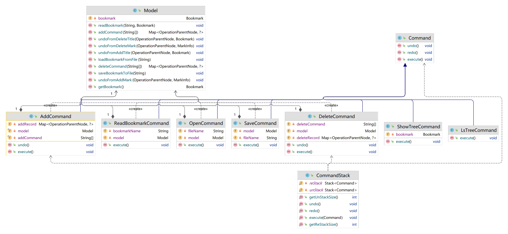
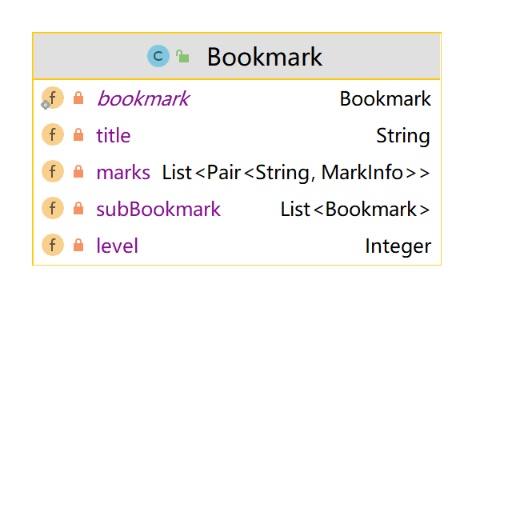
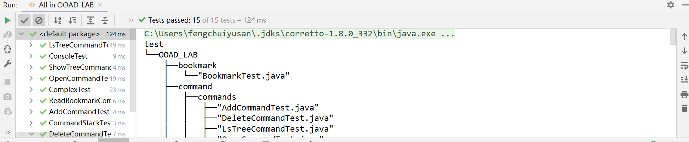

# Lab 设计模式

### 目录结构
```bash
├──src # 源文件代码目录
│   └──OOAD_LAB
│       ├──bookmark
│       │   ├──"Bookmark.java"
│       │   ├──"MarkInfo.java"
│       │   └──"OperationParentNode.java"
│       ├──bookmark_output
│       │   └──"test.bmk"
│       ├──command
│       │   ├──"Command.java"
│       │   ├──commands
│       │   │   ├──"AddCommand.java"
│       │   │   ├──"DeleteCommand.java"
│       │   │   ├──"LsTreeCommand.java"
│       │   │   ├──"OpenCommand.java"
│       │   │   ├──"ReadBookmarkCommand.java"
│       │   │   ├──"SaveCommand.java"
│       │   │   └──"ShowTreeCommand.java"
│       │   └──"CommandStack.java"
│       ├──"Console.java"
│       ├──"Entry.java"
│       ├──"FileIOUtil.java"
│       ├──"Model.java"
│       └──treeView
│           ├──bookmarkTree
│           │   ├──"BookmarkCP.java"
│           │   ├──"BookmarkNP.java"
│           │   └──decorator
│           │       ├──"BookmarkLabelProvider.java"
│           │       ├──"BookmarkReadCountDecorator.java"
│           │       ├──"BookmarkStarDecorator.java"
│           │       └──"ILabelProvider.java"
│           ├──fileTree
│           │   ├──"FileSystemCP.java"
│           │   └──"FileSystemNP.java"
│           ├──"INameProvider.java"
│           ├──"ITreeContentProvider.java"
│           └──"TreeViewer.java"
├──test  # 测试文件代码目录
│   └──OOAD_LAB
│       ├──bookmark
│       │   └──"BookmarkTest.java"
│       ├──command
│       │   ├──commands
│       │   │   ├──"AddCommandTest.java"
│       │   │   ├──"DeleteCommandTest.java"
│       │   │   ├──"LsTreeCommandTest.java"
│       │   │   ├──"OpenCommandTest.java"
│       │   │   ├──"ReadBookmarkCommandTest.java"
│       │   │   ├──"ShowTreeCommandTest.java"
│       │   │   └──"test.bmk"
│       │   └──"CommandStackTest.java"
│       └──"ConsoleTest.java"
└──"test1.bmk"
```

---
### 用到的设计模式

#### 命令模式
##### 使用场景
在实现add和delete的command时,将add和delete的操作封装成command,并将command压入栈中,实现undo和redo的功能.
而在实现其他command时,同样也是将操作封装成command
##### 类图

#####

#### 装饰器模式
##### 使用场景
在实现书签的星标和阅读次数的显示时,使用了装饰器模式,将书签的星标和阅读次数的显示封装成装饰器,并将装饰器添加到书签的labelProvider中,实现书签的星标和阅读次数的显示.
[注]:因手动测试用例未使用阅读次数,故show-tree时不打印阅读次数,但是对应的类以及代码都已经实现
##### 类图


#### 适配器模式
##### 使用场景
在实现树形结构的显示时,使用了适配器模式,将文件系统的树形结构和书签的树形结构封装成适配器,并将适配器添加到树形结构的显示中,实现树形结构的显示.
##### 类图


#### 单例模式
##### 使用场景
在对标签的状态进行保存时,使用了单例模式,将标签的状态封装成单例,实现标签的状态的保存.
##### 类图


---
### 未用到的设计模式与原因
#### 工厂模式
##### 原因
因为本次lab中的命令较少,且命令的类型较为简单,基本没有出现需要大量的更换整套内容的情况
同时,即使是需要从外部读取一些内容,也只是从文件中获取,比较简单,从而并未使用工厂模式

---
### 自动测试
#### 测试用例
测试函数一共有13个,用来测试各个命令以及console等类的基本功能

- add命令以及undo和redo功能(共两个)
  - addTitleCommandAndUndoTest()
  - addBookmarkAndUndoCommandTest()

- delete命令以及undo和redo功能(共两个)
    - deleteBookMarkCommandAndUndoTest()
    - deleteTitleCommandAndUndoTest()

- ls-tree命令(共一个)
    - lsTreeCommandTest()

- show-tree命令(共一个)
    - showTreeCommandTest()

- open命令(共一个)
    - openCommandTest()

- read-bookmark命令(共三个)
    - readBookmarkCommandTest1()
    - readBookmarkCommandTest2()
    - readBookmarkCommandTest3()
- console类(共一个)
    - consoleTest()

- commandStack类(共两个)
    - executeTest()
    - undoAndRedoTest()

#### 测试结果
测试13个函数,全部通过,测试结果如下图所示


